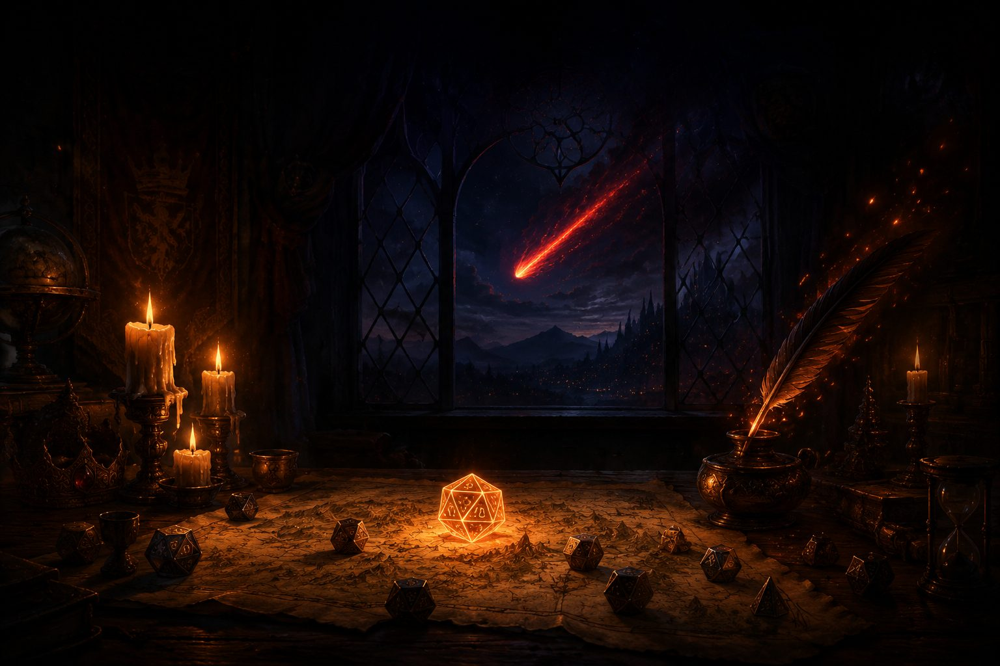

<p align="center">
  
</p>

<p align="center">
  
</p>

# Emberquill — AI Game Master

A realtime multiplayer D&D 5e game where an LLM runs the table. A host forges
a campaign, friends join with a 6-character room code, and DeepSeek narrates,
adjudicates, rolls (server-side, always), and commands the monsters — while
every player watches the same world update live.

## What's inside

- **AI Game Master** (`deepseek-v4-pro` via an OpenAI-compatible gateway):
  streams narration to all players simultaneously (token chunks append to a
  Convex document everyone subscribes to) and changes the world only through
  17 validated tools — dice, HP with full death rules, conditions, inventory,
  XP/levels, quest flags, locations, combat operations, SRD/rules lookups.
- **Full 5e SRD**: 2,182 records (monsters, spells, items, classes, levels…)
  seeded into Convex; rules prose embedded into Qdrant for RAG. Character
  creation runs the real SRD choice DSL (recursive proficiency/equipment
  choices), validated server-side.
- **Tactical combat**: server-enforced initiative, action economy, BFS
  movement with difficult terrain, the 5e condition advantage matrix, crits,
  spell slots/saves/AoE templates, death saves, AFK auto-rolls, host
  skip/remove controls — the GM plays the monsters through tools, the engine
  does all math.
- **Narrative memory**: every GM turn is distilled into a rolling summary +
  discrete scene/NPC/lore memories embedded in Qdrant
  (`gemini-embedding-2-preview`, 3072d) and recalled by similarity each turn.
  Degrades gracefully if Qdrant is down.
- **The 3D layer** (three.js / react-three-fiber): five living ambient scenes
  (GPU particle fields, flickering lights) that follow the story's location, a
  3D battlefield with gliding tokens and click-to-move picking, and physics
  dice (rapier) that tumble and *always* land on the server's roll via an
  exact face-remap. anime.js drives the 2D feel: streamed word reveals, ghost
  HP drains, banner sweeps, roll pops.
- **Scene visions**: any player can conjure an image of the current scene
  (`gpt-image-2`), stored in Convex storage with cooldowns and a daily cap.

## Stack

Next.js 16 (App Router) · React 19 · Tailwind v4 · anime.js 4 · three.js +
R3F 9 + drei + rapier · zustand · Convex (self-hosted) · Qdrant · OpenAI-compatible LLM
gateway (DeepSeek / Gemini embeddings / gpt-image-2).

## Running it (Docker — easiest)

```bash
git clone https://github.com/aimanzahar/d-d.git && cd d-d
docker compose up -d --build
# open http://localhost:3000
```

That's it — the image only serves the web app; it talks to the already-running
Convex/Qdrant/LLM backends. To point the frontend at a different Convex
deployment, change the `NEXT_PUBLIC_CONVEX_URL` build arg in
`docker-compose.yml` (it is baked into the client bundle at build time, so
rebuild after changing it). Backend function pushes and seeding still happen
from a dev checkout with `npx convex dev` (see below).

## Running it (local dev)

```bash
npm install

# .env.local
CONVEX_SELF_HOSTED_URL='https://<your-convex>'
CONVEX_SELF_HOSTED_ADMIN_KEY='<admin key>'
NEXT_PUBLIC_CONVEX_URL='https://<your-convex>'

# Convex server-side env
npx convex env set LLM_BASE_URL  https://your-openai-compatible-endpoint/v1
npx convex env set LLM_API_KEY   sk-...
npx convex env set QDRANT_URL    https://<your-qdrant>
npx convex env set QDRANT_API_KEY ...

npx convex dev          # push functions (keep running for live dev)

# one-time seeding
node scripts/gen-static-srd.mjs
npx convex run seed:runSrdSeed
npx convex run seed:ensureQdrant
npx convex run seed:seedRulesToQdrant

npm run dev
```

Create a campaign on the landing page, send friends the code, forge heroes,
and begin the adventure.

---

This work includes material taken from the System Reference Document 5.1
("SRD 5.1") by Wizards of the Coast LLC, available at
https://dnd.wizards.com/resources/systems-reference-document, licensed under
the Creative Commons Attribution 4.0 International License.
